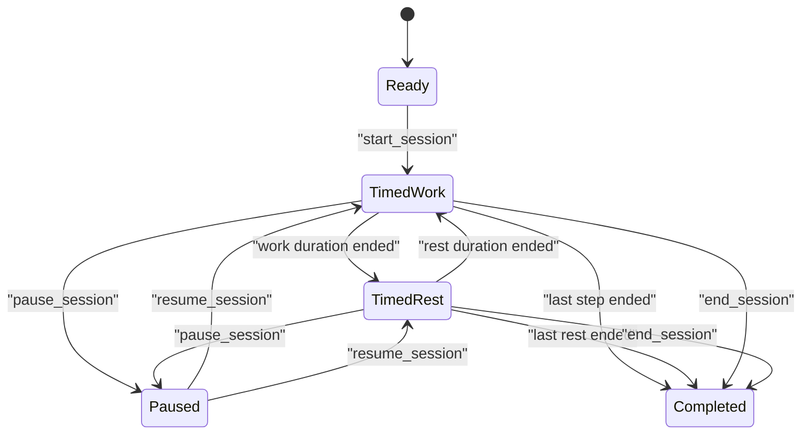
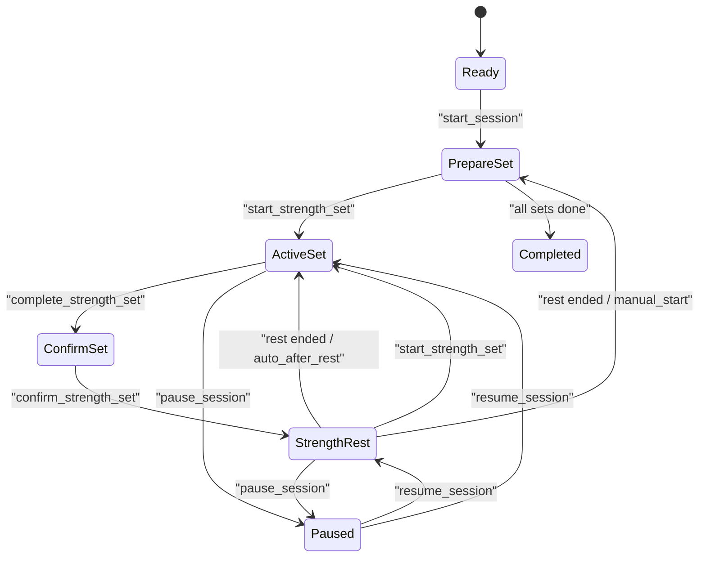

# TrainFlow Android 首版架构

## E17 remainder V11 accepted Architecture（当前 planning authority）

`docs/planning/e17-remainder-epic-story-plan.md` 是 E17 remainder 唯一 detailed Architecture / schema / owner / lifecycle authority。其 exact V11 source（`SHA-256=6A92D46A835B637DDFBB9DEC09A661D72736768C07FD16866F88AAF62EAB8736`）已通过 re-Planning Review Attempt 5（`SHA-256=92C11E019EFEBA016C9E3DFCC0FECCADD2B902A8FD785A9048D850A9CAD8570B`，`PASS`）和 scoped Consistency re-Audit Attempt 2（`SHA-256=39FB55004A24A331BAB078BF02D546CDC749836DCCDF7830B5F58E25DF7C8541`，`PASS / CONSISTENCY=PASS`）。

V11 接受的 Architecture 包括五表方向与原子 `Migration(4,5)`、canonical session graph、心率 recording / acquisition / sample / analysis snapshot、closed storage JSON、version-aware read、export / lease / provider、`U-A`、`R-A`、`CC-D03-B`、`P-BALANCED-V2`，以及 CS-03 / CS-05 / CS-09 / CS-12 的唯一 owner 边界。这里只建立权威链接，不复制 detailed contract。

Accepted base `abf85553bc0c4a71793858734af265b634caab69` 已完成 tracked planning sync，并选择 root Story `E17-CS-03`。当前 Story 分支 `codex/e17-cs-03-canonical-schema-migration-foundation` 是 `IMPLEMENTED_CANDIDATE / NEEDS_FRESH_INDEPENDENT_REVIEW / NOT_MERGED`：候选把 Room 从 v4 提升到 v5，以同一 canonical DDL 支撑 fresh v5 与原子 `Migration(4,5)`，新增七个 session header 列、五张表、entity / DAO / relation、pure validators 和 plan snapshot storage v1；v4 legacy 行保持七列全 NULL。

该候选不包含 runtime Recorder、finalizer、legacy reader、history projector、UI、export、BLE 或 device 行为，也没有 APK、AVD、device、human 或 performance evidence。只有候选通过 fresh 独立 Review、完成 `--no-ff` merge / push、候选 full SHA 成为同步 `main` / `origin/main` ancestor 且状态文档一致后，CS-03 才可提升为 `reviewed / merged`；候选状态本身不解锁 CS-04。

本节以下带日期 E11 / E16 / 早期 E17 架构记录保留为 `non-operative / historical`。其中旧 future-only recording classification 或旧 Planning Review / Audit gate 的当前式措辞不得覆盖 V11 accepted Architecture。

## 2026-07-26 E17 当前架构覆盖

保留 Application / 进程级唯一 `HeartRateRuntimeOwner`、main-looper serialization、generation / attempt / raw GATT identity、先失效引用的 cleanup、唯一 ID `7200` writer、合法 `connectedDevice` FGS 与 `START_NOT_STICKY`。自动恢复是 owner policy，不恢复 D-078、E16 controller / wrapper，不新增第二 owner、GATT model 或第三 notification interface。

Eligibility 为 opt-in + saved exact + permission + Bluetooth + no persistent suppression + visible 或合法 active-training FGS。前台使用有间隔的 bounded scan windows 且 eligibility 成立时长期 armed；非训练后台 cleanup、回前台重新计算并自动恢复；active training 普通 `ON_STOP` 不直接 cleanup，合法 FGS 下 retain / recover exact target。进程死亡不会复活旧引用、GATT 或 attempt，Service 仍为 `START_NOT_STICKY`；新进程首次明确 visible，或新的合法 active-training FGS eligibility 成立时，只能由唯一 Application owner 以新 generation / attempt 自动恢复，不能演变成 sticky Service、隐式后台常驻或第二 owner。E17-7a 承担 policy / persisted suppression / parameters / tests，7b 承担 Application / settings / capsule，8 ordinary，9 FGS / training recovery / M1，10 evidence-only。

bounded-window delay、eligibility recheck 与 recovery timing 都属于唯一 `HeartRateRuntimeOwner` 内的 concrete main-looper policy；不得新增 standalone / generic retry scheduler、watchdog、backoff controller、actor、wrapper或相关 production abstraction。测试复用现有 deterministic main queue / time control，不得为了测试便利反向增加 production scheduler abstraction。

active / paused training 已在 background / lockscreen 且 eligibility 仍成立时，unexpected disconnect 不触发 FGS demotion：FGS 与 ID `7200` 唯一 writer 保持 active，notification 准确显示 reconnecting，由同一 Application owner 以新 generation / attempt执行 bounded recovery。只有 eligibility 失败、显式断开 / opt-out / target clear、training terminal、FGS legality failure，或 App 已明确 foreground 且不再需要 FGS 时才 demote / stop；Service 始终不是 GATT owner。

参数与 presentation 计算边界、禁止 candidate 与 merge-stable truth 以新 Correct-course 为准；E17-5 / 6 已合并资产保留。

**文档状态:** 首版架构草案  
**范围:** Android MVP 生产工程与未来 iOS 共享边界  
**不包含:** 具体 Android 工程脚手架、UI 视觉定稿、完整动作内容导入、真实设备接入实现

## 1. 架构目标

本架构要支持 TrainFlow 首版的 4 个核心结果：

1. 用户可以创建、保存、复用计时训练和力量训练计划。
2. 用户可以稳定执行训练，训练中计时、休息、临近结束提醒和力量组记录不丢状态。
3. 动作库、训练计划、训练会话和恢复建议之间有清晰数据边界。
4. 未来语音、心率、媒体和 iOS 适配可以接入，但不增加首版实现负担。

## 2. 架构原则

1. **Android 原生首发。** 首版生产 App 使用 Kotlin 与 Jetpack Compose，优先保证 Android 训练执行、通知、震动、音频和后台行为可靠。
2. **业务核心与平台能力分离。** 训练计划模型、训练执行引擎、训练命令、训练事件和恢复规则放在业务层；通知、音频、震动、健康数据和设备接入放在平台适配层。
3. **本地优先。** 首版以本地持久化为主，不依赖云同步，不要求登录账号。
4. **执行引擎优先于页面状态。** UI 只发命令并展示状态；训练推进、计时、事件产生和记录写入由可测试的业务组件负责。
5. **先保留接口，不展示假能力。** 语音、课程、音乐节拍、AI 纠错等未实现能力只保留模型和适配边界；心率在 D-080 / D-081 / D-082 后进入显式 opt-in 的 E17 路线，但各 Story prerequisite 与真实 AVD / Band 9 gate 通过前仍不得伪装为已完成 production 能力。

## 3. 技术基线

| 领域 | 首版选择 | 说明 |
|---|---|---|
| App 平台 | Android 原生 | 未来 iOS 另行适配，业务语义保持可迁移。 |
| 语言 | Kotlin | 与 Android 生态、协程、Room、Compose 配合。 |
| UI | Jetpack Compose | 单 Activity，多页面导航，适合训练执行页状态驱动更新。 |
| 设计系统 | `DESIGN.md` | 官方默认 UI token 与设计语义单一真源。 |
| 架构风格 | 分层架构 + feature 模块 | UI、domain、data、platform adapter 分离。 |
| 异步 | Kotlin Coroutines + Flow | 训练计时、状态订阅、数据库流式观察。 |
| 本地数据库 | Room | 保存动作、计划、会话、组记录、恢复映射。 |
| 偏好设置 | DataStore | 保存提醒偏好、训练默认值、默认关闭的心率 opt-in、saved-device convenience hint、D-082 manual suppression 与个人参数；心率 production implementation 受 E17-7a -> 7b -> 8 -> 9 -> 10 顺序门禁约束。 |
| 依赖注入 | Hilt | 生产实现与测试替身解耦。 |
| 后台与提醒 | Notification + WorkManager/Alarm 边界 | 首版普通提醒，不做闹铃级强提醒硬依赖。 |
| 最小网络 | 无必需网络 | 首版动作内容可随包或本地导入，后续再加同步。 |

## 4. 应用模块建议

首版 Android 工程建议从以下模块起步。早期可以先用较少 Gradle 模块实现，代码包结构仍按此边界组织；当体量增加后再拆物理模块。

```text
app
core:model
core:database
core:datastore
core:domain
core:engine
core:notifications
core:media
core:health
ui:designsystem
ui:theme
ui:shell-official
feature:home
feature:plans
feature:exercise-library
feature:workout-session
feature:history
feature:recovery
feature:settings
```

### 4.1 `app`

- 提供 Android Application、MainActivity、导航图、主题、Hilt 入口。
- 不直接包含训练业务规则。
- 只组装 feature 页面和全局依赖。

### 4.2 `core:model`

- Kotlin data class 与枚举，映射 `docs/planning/data-contracts.md`。
- 包含 `Exercise`、`WorkoutPlan`、`PlanBlock`、`WorkoutSession`、`WorkoutCommand`、`WorkoutEvent`、`HeartRateState`、`RecoveryRecommendation`。
- 不依赖 Android SDK，未来可迁移到 KMP 或 iOS 共享语义。

### 4.3 `core:domain`

- 用例和业务规则。
- 计划创建、计划复制、计划校验、动作筛选、恢复建议生成、训练总结生成。
- 不直接读写 Room，不直接调用 Android 通知、震动、音频。

### 4.4 `core:engine`

- 训练执行引擎，负责命令到状态的转换。
- 输入是 `CommandEnvelope` 和时间 tick。
- 输出是 `WorkoutSessionState` 与 `WorkoutEvent`。
- 首版必须覆盖计时训练和力量训练两条状态机。
- 不直接操作 Compose，不直接展示 UI。

### 4.5 `core:database`

- Room entities、DAO、migration。
- 保存标准动作、训练计划、训练会话、步骤记录、力量组记录、恢复区域和恢复映射。
- 计划快照必须随训练会话保存，避免历史记录被后续计划修改污染。

### 4.6 `core:datastore`

- 保存轻量偏好：
  - 默认临近结束提醒秒数。
  - 声音、震动、强化动画开关。
  - 力量训练本组计时默认模式。
  - 默认关闭的心率 opt-in 与 saved identifier / display name convenience hint；不保存 GATT、bpm 或 session summary。

### 4.7 `core:notifications`

- 计划提醒通知。
- 活跃训练通知。
- 前台训练服务边界。
- E7.2 / D-027 是普通训练的历史与当前基线：普通 active / paused 训练不启用 foreground service，只提供 ordinary ongoing active workout notification。D-081 是窄例外和部分 supersession；D-082 再窄 supersede “unexpected disconnect 立即降级”的含义：active / paused training 已在 background / lockscreen 且 eligibility 仍成立时，`connectedDevice` FGS 与 ID `7200` writer继续 active并进入 reconnecting，只有停止资格成立或明确 foreground 不再需要 FGS 时才降级。Route dispose 不再拥有最终清理权，完整单一 writer 合同见第 8.1 节。
- 不包含训练状态机，只消费 `WorkoutEvent`、训练 UI state 或 engine state 摘要。

### 4.8 `core:media`

- 提示音播放。
- 后续语音提示、动作媒体播放、跟练媒体播放的接口边界。
- 首版只需要可由训练事件触发的提示音能力。

### 4.9 `core:health`

> **E17 当前架构基础（D-081）与恢复策略覆盖（D-082，2026-07-26）：** Application / 进程级唯一 `HeartRateRuntimeOwner`、现有 `HeartRateProvider`、main-looper serialization、generation + attempt ID + raw GATT identity、cleanup、合法 `connectedDevice` FGS 与单一通知继续有效；D-082 仅覆盖 manual-only / no-reconnect 冲突，恢复 eligibility 与 Story / evidence 合同以本页和 `docs/planning/e17-auto-reconnect-and-personal-parameters-correct-course.md` 为准。D-081 / E17-3 原文继续作为历史决策记录，不生成相反的当前任务。

- E17 唯一冻结边界是浮动心率胶囊的视觉与互动：`HeartRateFloatingCapsule.kt`、`HeartRateCapsuleGeometry.kt`、相关 motion 表现、approved HTML、collapsed / expanded、拖动 threshold、左右吸附、viewport clamp、安全区与 IME 避让。
- `HeartRateFloatingCapsuleState.kt` 中的旧 provider 状态、文案、mapper、优先级不冻结；state source、presentation state 和 `TrainFlowApp` runtime wiring 可在 E17-2 / E17-3 重做。
- `HeartRateRuntimeOwner` 唯一持有 scanner、scan callback、target、`BluetoothGatt` 和 `BluetoothGattCallback`；settings、胶囊、Compose 页面和 foreground service 只能发动作或观察状态，不能成为第二 owner。
- permission TOCTOU 只在具体 Android BLE 调用处窄捕获 `SecurityException`；不捕获 arbitrary lambda 的 `IllegalStateException`，不按异常 message / 厂商字符串分类。
- Android BLE runtime facts、用户事实 `HeartRateState` 和胶囊 presentation state 分层；旧 bpm 在 freshness 失效后不得继续显示为 live。
- malformed payload 仅是内部 runtime diagnostic：不刷新 `lastValidSampleAt`，不以旧 bpm + 新时间戳续写 `Live`，也不立即发布公共 `TechnicalFailure`；已有 fresh 样本只支撑到原 freshness 截止点，无有效样本时保持 waiting / 当前合法状态。只有独立的平台、连接、discovery、characteristic 或 CCCD 失败才形成公共技术失败。
- freshness 与自动重连不得默认绑在同一 Story；自动重连需要独立价值决策、独立架构和独立真机验收。

- `HeartRateProvider` source-aware 抽象接口与 disabled / mock / source-unavailable 实现。
- E11.1 只收口 provider boundary 和不可用状态表达，不绑定具体手环 SDK，不接 Health Connect、Wear OS、BLE 或厂商 SDK。
- 后续真实设备接入必须通过 provider adapter 转换为 `HeartRateState`，不能把 SDK model 泄漏到 UI、训练执行引擎、历史统计或 analytics。
- E11.2a 已记录广播未开启 / Huawei Health 连接占用条件下未发现 Band 9 标准 BLE HRS；E16 广播开启 retest 已在 debug-only 工具中取得 Band 9 BLE HRS 正向证据并合入 main（merge commit `bbd4296`）。该证据只允许后续另拆 `E16-1 BLE HRS adapter spike`，不直接进入生产接入或生产 UI。
- E16-1 adapter spike 已把标准 HRS payload parser 落为纯 Kotlin utility，并把 BLE scan / GATT / notify lifecycle 封装在 `app/src/debug` 的 `BleHeartRateProvider` 测试入口；该 debug provider 不注入生产路径，不申请 production manifest 蓝牙权限，不接训练执行页、Room、records、history 或 trends。
- E16-2 允许 production-capable `AndroidBleHeartRateProvider` 地基位于 `core.health`，但默认 App 路径不调用 scan / connect，不申请 production manifest BLE 权限，不接训练页 UI、Room、records、history 或 trends。该 provider 只通过显式调用启动扫描，使用固定 scan window，stop / disconnect / close 和失败路径必须关闭 GATT，并把 SDK model 限定在 provider 内部。
- E16-3a 已完成 App 内浮动心率胶囊 HTML 视觉修订；E16-4 已完成 opt-in / settings / permission rationale planning。Provider 仍不得直接接到训练 UI 或记录层；后续必须先通过设置页显式 opt-in、权限说明、设备选择和非医疗文案，再分 story 接入胶囊 UI。浮动胶囊仍必须消费 `HeartRateState` / 后续 zone mapper 的抽象状态，不得直接依赖 Android BLE SDK model。

### 4.10 `ui:designsystem`

- 官方默认组件、token 映射和训练状态视觉语言。
- 以根目录 `DESIGN.md` 为设计系统单一真源。
- 提供按钮、输入框、卡片、chip、底部导航、训练倒计时、训练确认层等基础组件。
- 社区 UI 变体可以复用，也可以 fork，但不得改变核心训练语义。

### 4.11 `ui:theme`

- 管理官方主题和社区主题的编译期映射。
- 主题可以改变颜色、字体、圆角、间距和组件外观。
- 主题不得隐藏训练执行所需主信息，也不得弱化安全和权限提示。

### 4.12 `ui:shell-official`

- 官方 App shell、首页布局、底部导航和页面组合。
- 允许开源社区创建替代 shell，例如力量训练优先首页、大字版训练界面或暗色优先 shell。
- 替代 shell 必须遵守 `docs/ui-extension-guide.md` 的 UI shell 合同。

### 4.13 feature 模块

| 模块 | 职责 |
|---|---|
| `feature:home` | 训练首页、最近计划、继续训练入口。 |
| `feature:plans` | 计时/力量计划创建、编辑、详情、提醒设置。 |
| `feature:exercise-library` | 动作库列表、筛选、动作详情、训练中动作详情入口。 |
| `feature:workout-session` | 计时训练执行页、力量训练执行页、跟练雏形页、确认层。 |
| `feature:history` | 训练总结、训练记录、基础趋势。 |
| `feature:recovery` | 训练后恢复建议。 |
| `feature:settings` | 训练偏好、通知偏好和健康数据边界偏好；E17 心率 opt-in、权限说明与用户主动设备操作的 canonical setup 入口。 |

## 5. 分层数据流

```text
Compose Screen
  -> ViewModel
  -> UseCase / WorkoutEngine
  -> Repository
  -> Room / DataStore / Platform Adapter

WorkoutEngine
  -> WorkoutEvent
  -> UI / Sound / Haptics / Notification / Analytics
```

### 5.1 UI 层

- Compose 页面只展示 `UiState` 并发出用户意图。
- 训练中按钮不直接改 session 数据，而是发 `WorkoutCommand`。
- 训练执行页必须从引擎状态恢复，不把关键状态只存在 ViewModel 内存。

### 5.2 Domain 层

- 统一计划校验：
  - 计时训练必须有可执行动作或阶段。
  - 力量训练必须有动作和至少一组。
  - 临近结束阈值不能大于对应动作或休息时长。
- 统一动作能力校验：
  - 计时计划只能加入支持计时训练的动作。
  - 力量计划只能加入支持 reps 或 weight 的动作。
  - 跟练雏形优先使用支持跟练展示的动作。

### 5.3 Data 层

- Repository 输出 domain model，不把 Room entity 暴露给 UI。
- 首版允许对 `PlanBlock`、`WorkoutPlanSnapshot` 使用 JSON 字段保存，以降低多态结构早期建模成本；关键查询字段仍应单独列化。
- 后续若需要复杂统计，再把 blocks 和 session steps 进一步规范化。

## 6. 数据模型映射

### 6.1 Room 表建议

| 表 | 说明 | 关键字段 |
|---|---|---|
| `exercises` | 标准动作库 | `id`、`name`、`category`、`equipment`、`difficulty`、`capabilities_json`、`content_status` |
| `workout_plans` | 用户训练计划 | `id`、`mode`、`title`、`blocks_json`、`reminder_json`、`preferences_json`、`created_at`、`updated_at` |
| `workout_sessions` | 训练会话；CS-03 candidate 增加 nullable canonical header | 既有字段 + `timeline_version`、`last_durable_offset_ms`、`last_mutation_sequence`、`trusted_end_offset_ms`、`terminal_reason`、`display_metadata_contract_version`、`session_display_metadata_json` |
| `session_step_records` | 执行步骤记录 | `id`、`session_id`、`step_id`、`kind`、`exercise_id`、`started_at`、`ended_at`、`skipped`、`actual_duration_sec`、`planned_duration_sec` |
| `timed_rest_extension_records` | 计时训练额外休息记录 | `id`、`session_id`、`step_id`、`step_index`、`round_index`、`rest_stage_id`、`previous_stage_id`、`added_sec`、`planned_rest_sec`、`extension_at_remaining_sec`、`cumulative_extra_rest_sec` |
| `strength_set_records` | 力量组记录 | `id`、`session_id`、`exercise_id`、`source_set_plan_id`、`set_order`、`planned_json`、`actual_json`、`active_duration_sec`、`actual_rest_after_sec`、`effort` |
| `recovery_areas` | 恢复区域 | `id`、`name`、`body_region`、`summary` |
| `recovery_recommendations` | 训练恢复建议 | `id`、`session_id`、`trained_muscle_ids_json`、`area_ids_json` |
| `workout_phase_intervals` | canonical phase partition | session FK cascade、连续 sequence、canonical tuple、open marker、closed phase identity JSON |
| `heart_rate_recordings` | 每 session 至多一个 recording header | source / acquisition / parameter versions、frozen max / zone parameters、terminal analysis binding |
| `heart_rate_acquisition_intervals` | recording intent 与 device-state 正交 partition | recording FK cascade、连续 sequence、canonical tuple、open marker、closed literals |
| `heart_rate_samples` | 最小 canonical observation | `(recording_id,sample_sequence)` PK、`offset_ms`、`mutation_sequence`、`bpm`；显式 canonical order index |
| `heart_rate_analysis_snapshots` | immutable versioned analysis snapshot | `(recording_id,analysis_version)` PK、input cut、typed axes、aggregates / duration / reason JSON |

### 6.2 快照规则

- 开始训练时生成 `WorkoutSession`。
- 会话保存 `WorkoutPlanSnapshot`。E10.4 MVP 的本地 `plan_snapshot_json` 需要保存完整 blocks 结构和已存在的 preferences / cue / followAlong 元数据，不能只保存 title / mode；`WorkoutSession.planId` 与快照内可选 `planId` 一起保留计划来源。
- CS-03 candidate 的新 canonical session 使用 literal `planSnapshotStorageContractVersion=1`、七个固定 root keys 和稳定 UTF-8 JSON；strict parse 后重序列化必须与 persisted bytes 完全一致。`Migration(4,5)` 不改写既有 unversioned snapshot，legacy strict reader 仍由 CS-09 独占。
- 后续编辑计划不影响历史会话。
- 力量组记录保存计划值与实际值，不能只保存差异。
- E10.4 起，计时、力量和基础跟练 completed / abandoned 终态通过 repository 写入本地 Room session records；记录页从该真实本地源读取。终态写入使用一次性 guard 和异常吞并边界，避免 route 重组重复插入或 Room 异常直接 crash UI。
- E10.4 的时长口径为：`total_elapsed_sec` 优先来自 startedAt 到 endedAt 的 wall clock，包含准备、确认、休息、正式组和暂停；`effective_elapsed_sec` 不包含暂停，力量训练当前只包含正式组与休息推进，不把 prepare / confirm 停留时间计入 effective；`paused_elapsed_sec` 单独保存暂停累计。
- E10.4 只前置本地 Room 记录闭环，不实现统计图表、历史删除、云同步、账号体系、后台可靠计时、心率设备或语音能力。
- E10.14 起，计时训练 `+15秒` 额外休息通过 `timed_rest_extension_records` 保存为 actual session record。该记录不修改原计划或 plan snapshot，不计入 `paused_elapsed_sec`，供 E12 后续统计哪些轮次、阶段或前序工作 / 自定义阶段后更常需要额外休息。

## 7. 训练执行引擎

训练执行引擎是首版架构核心。

### 7.1 输入

- `WorkoutPlanSnapshot`
- `WorkoutCommand`
- 时间 tick
- 用户偏好

### 7.2 输出

- 当前 `SessionStep`
- 当前剩余时间
- 训练进度
- 待确认记录草案
- `WorkoutEvent`
- 可持久化的 `WorkoutSession` 变更

### 7.3 计时训练状态



计时训练必须区分：

- 动作临近结束事件。
- 休息临近结束事件。
- 跳过动作。
- 延长休息。
- 暂停时剩余时间冻结。

### 7.4 力量训练状态



力量训练必须保证：

- `开始本组` 后才记录本组耗时。
- `完成本组` 后先生成确认草案。
- 确认层默认回填计划重量和计划次数。
- 用户确认后再写入正式 `StrengthSetRecord`。
- 休息倒计时和休息临近结束提醒独立于动作组耗时。
- 力量休息临近结束提醒复用 `WorkoutEvent.RestEnding` 与 `CueSettings.restEnding`，阈值大于休息时长时按当前休息时长裁剪，默认 5 秒应覆盖短休息的全部倒计时。
- `StrengthExerciseBlock.setTimerMode` 决定休息结束后的推进：`manual_start` 回到准备态等待手动开始，`auto_after_rest` 直接进入下一组 active set。

## 8. 平台能力边界

### 8.1 通知与训练提醒

首版采用普通训练提醒，不把闹铃级强提醒作为 MVP 硬依赖。

- 计划提醒：通过通知调度实现，允许系统延迟。
- 普通活跃训练：沿用 D-027 / E7.2 ordinary ongoing notification，摘要来自训练 UI state 或 engine state，不反向进入训练执行引擎；active / paused 本身不普遍变成 FGS，也不承诺普通训练后台精确计时。
- D-081 窄例外：只有 active / paused training 的合法心率连接或 D-082 bounded recovery 使用 `connectedDevice` FGS；background / lockscreen unexpected disconnect 且 eligibility 仍成立时不得退回 ordinary，FGS 与 ID `7200` writer保持 active、content显示 reconnecting，同一 Application owner以新 generation / attempt恢复。只有 eligibility 失败、显式断开 / opt-out / target clear、training terminal、FGS legality failure，或明确 foreground 不再需要 FGS 时才退回 ordinary。
- 不新增第三个核心 notification interface。适配现有 `ActiveWorkoutNotificationController` contract，使其 production instance 成为 Application / 进程级唯一协调者；Route 只提交训练状态。固定 ID `7200` 概念上只有 `NONE`、`ORDINARY_WORKOUT_NOTIFICATION`、`HEART_RATE_FOREGROUND_SERVICE` 三种模式，任一时刻只有一个 writer，不产生第二条常驻通知。
- FGS 升级：协调者保存最新状态并进入 handoff，从允许的可见前台调用 `startForegroundService()`；Service 在 `onStartCommand()` 路径立即调用 `ServiceCompat.startForeground(7200, notification, FOREGROUND_SERVICE_TYPE_CONNECTED_DEVICE)`，不加人为延时。FGS content 必须准确说明后台心率连接，不能沿用普通通知“不是 foreground service”的文案。
- `POST_NOTIFICATIONS` 拒绝时，ordinary notification 可以不发布；FGS 仍必须构造 notification 并传给 `startForeground()`，不得复用现有 `Ignored -> clear / no content` 分支。系统仍可能在 Task Manager / Active apps 展示 FGS。
- FGS 降级：仅在上述停止资格成立后，先有序停止 / demote FGS并交还 ID `7200` writer，再由协调者以同一 ID 恢复 ordinary notification；若通知权限拒绝则可不发布。background unexpected disconnect 的 bounded recovery 不进入此分支。具体 `stopForeground()` flag 必须证明 handoff 有序、幂等、无重复 cancel。
- Route dispose 不能取消仍活跃训练的通知；terminal 时协调者停止 FGS并对 `7200` 最终移除一次。重复 terminal、Service stop、Route dispose 与 cleanup 必须幂等。
- FGS 启动 / 提升失败不创建第二个 GATT owner；明确前台可保留前台连接并发布准确失败事实，随后无合法 FGS 而进入后台必须 cleanup。
- 权限：清楚解释通知权限用途。

### 8.2 声音与震动

- 声音和震动都是 `WorkoutEvent` 的消费者。
- 倒计时最后 N 秒是否播放声音/震动由 `CueSettings` 控制。
- `soundEnabled=false` 只阻止声音请求；声音实现不得请求 audio focus、主动 duck 或暂停外部音频。
- 首版不播放语音读秒；仅保留 `voiceCueEnabled` 和语音输出适配接口。

### 8.3 心率与健康数据

D-080 / D-081 已 supersede 早期“首版全面不显示心率”的当前式产品范围，D-082 又窄 supersede manual-only / no-reconnect 冲突。当前 E17 接受默认关闭、用户显式 opt-in 后通过标准 HRS 与冻结胶囊显示实时心率；E17-4 readiness 已通过，后续 production 只能按 D-082 Correct-course 的 E17-7a -> 7b -> 8 -> 9 -> 10 prerequisite 顺序推进：

```kotlin
interface HeartRateProvider {
    val heartRateState: Flow<HeartRateState>
}
```

- 唯一 Application / 进程级 `HeartRateRuntimeOwner` 实现现有 `HeartRateProvider`；不创建平行 provider、通用 BLE framework 或完整 GATT wrapper。
- owner 使用 Android main looper 串行化全部状态转换；connect attempt 先建立，再调用带 main `Handler` 的 `connectGatt()`，并以 attempt ID + raw GATT 对象引用绑定 callback。
- `HeartRateState` 区分 disabled、permission unavailable、Bluetooth off、not connected、connecting、waiting data、live、data interrupted / stale、explicit link disconnect、technical failure 和 intentional stop；Android BLE 对象与用户文案都不能成为 core 状态输入。
- 用户可主动发起有限时 HRS scan、saved identifier 精确匹配或手动选择；用户已 opt-in、保存 exact target、permission / Bluetooth 合法、无 persistent manual suppression，且 App 明确 visible 或 active / paused training 已合法建立 `connectedDevice` FGS 时，自动恢复 eligibility 成立。前台意外断连、out-of-range、App 启动 / recreation 后首次 visible 或非训练后台返回 visible，使用有间隔的 bounded scan windows 恢复 exact target，并在 eligibility 持续成立时长期 armed；单轮失败或固定次数耗尽不得永久 disarm。名称、display name 和附近其他 HRS 设备不能替代 exact target，也不得自动换 target。
- bounded-window delay、下一窗口 eligibility 复核与 recovery timing 只由唯一 owner 的 concrete main-looper policy 排队和取消；不引入 standalone / generic retry scheduler、watchdog、backoff controller或相关 production abstraction。测试只能使用现有确定性 main queue / time control。
- 权限失败、Bluetooth off、opt-out、清除 target、显式断开、非训练后台和不合法的 active-training 后台先使相应 eligibility 失败，再失效 attempt 并幂等 stop / disconnect / close。非训练后台不持续 scan / connect；返回明确 visible 后重新计算 eligibility，成立才自动恢复。显式断开必须持久 suppression，同时保留 opt-in、saved target 与个人参数；只有明确重新连接或选择目标才能解除。训练 terminal 是否 cleanup 由下条进程可见性与 FGS 规则决定，不再无条件绑定。
- 活跃训练已有合法当前连接且进入锁屏 / 临时后台时使用 `connectedDevice` foreground service；Service 经唯一通知协调者复用 ID `7200` 且不持有 GATT。普通 Activity / Route `ON_STOP` 不是 cleanup 信号。连接未 cleanup、未丢失时，回前台必须继续观察同一 Application owner、同一 attempt lineage 与 current bpm；若后台意外断连且 eligibility 仍成立，FGS与唯一writer继续active、notification显示reconnecting，只允许同一 Application owner以新 generation / attempt恢复 exact target，不能伪称 same attempt，Service不得成为GATT owner。训练完成 / 放弃且 App 明确仍在前台时，停止 / demote FGS并最终移除训练通知；仍合法且未 cleanup 的连接可转为非训练前台只显示不记录。terminal 在后台、锁屏或进程可见性不确定时停止 FGS并cleanup；其他demotion只发生在eligibility失败、显式断开/opt-out/target clear、FGS legality failure或明确foreground不再需要FGS时；Route存在不等于进程前台。
- Service 保持 `START_NOT_STICKY`。进程死亡关闭旧连接，绝不复活旧 callback、GATT、generation 或 attempt；如果持久偏好仍满足 opt-in + saved exact target + no suppression，下一次新进程明确 visible，或新的合法 active-training FGS eligibility 成立时，由唯一新 owner 以新 generation / attempt 自动恢复。它不是 sticky Service、后台无限 scan 或旧引用复活。
- freshness 只使用 monotonic time 判断最近有效 bpm 是否仍 current，与 reconnect 完全解耦；具体阈值由首个 runtime implementation Story 在编码前依据 Band 9 notify 间隔、锁屏调度余量和边界测试确认，不继承 D-078。
- 以下 E11 / E16 条目保留为 historical / reference，不能覆盖 D-080 / D-081，也不能解锁 production implementation。
- E11.1 / E11.3 当时不申请真实健康、蓝牙或身体传感器权限，不实现或保留手动输入 UI，不持久化心率，不绘制平均心率趋势，也不接 HealthKit、Huawei Health Kit / Health Service Kit、BLE 或厂商 SDK；这是历史 Story 范围。
- 不做实时心率预警闭环，不做医疗、危险或训练中断判断。
- 不因没有设备或没有手动输入而阻塞训练闭环；默认关闭或无可用实时数据时不得显示假 bpm。
- E11.2a 和 E16 retest 都不持久化心率，不绘制平均心率趋势，不把执行页瞬时 `HeartRateState` 当历史事实，不申请生产健康 / 蓝牙 / 身体传感器权限。
- 后续 Apple Watch / iOS 保留为 iOS 第一优先路线，合理架构是 iOS app + watchOS companion + HealthKit / HKWorkoutSession / HKLiveWorkoutBuilder；当前 Android-first 阶段不进入 dev，且 Apple SDK model 不能泄漏到 TrainFlow UI / history / analytics。
- HUAWEI Band 9 当前只作为 feasibility 样本。E11.2a 原条件没有发现标准 BLE HRS；E16 广播开启 retest 已发现 `HUAWEI Band HR-OD7` 广播 `0x180D`，连接后发现 `0x2A37 props=notify`，CCCD 写入成功并收到 bpm notify。后续若优先做心率设备，只能另拆 `E16-1 BLE HRS adapter spike`，先处理连接生命周期、来源标注、权限、用户 opt-in 和非医疗边界。
- E16-1 已实现 debug-only BLE HRS adapter spike：标准 payload parser 可测试 8-bit / 16-bit bpm 与 flags；debug provider 可在真机上输出 scanning、device found、connecting、service discovered、notify enabled、bpm received、disconnected / stopped 状态，并把 bpm 映射为 `HeartRateState`。这仍不是生产接入。
- E16-2 已将 BLE HRS provider 基础生产化到 `core.health`：状态边界覆盖 no source、permission required、bluetooth disabled、scanning、device found / selected、connecting、connected waiting for data、live bpm、stale / disconnected 和 recoverable error；权限规划明确 Android 12+ 的 `BLUETOOTH_SCAN` / `BLUETOOTH_CONNECT` 与 Android 11 及以下 scan compatibility 的 `ACCESS_FINE_LOCATION`，但权限请求只能由未来显式用户动作触发，不在 app 启动时触发。DataStore 只保存可选 device identifier / display name；Android privacy、BLE private address 和 Band broadcast label/address 变化意味着该 identifier 不能被当作稳定医疗设备身份。
- E16-3 初版顶部 pill 方案不再作为推荐实现；当前未来 UI 方向是 App 内可拖动浮动心率胶囊，不使用 `SYSTEM_ALERT_WINDOW` / “显示在其他应用上层”权限。胶囊属于 TrainFlow app shell overlay，不参与训练页布局，不得遮挡主按钮、底部导航、confirm-record 控件、输入框、键盘区域、状态栏或手势导航；松手后必须吸附到安全边缘。
- E16-4 当时已明确、D-080 现继续要求：心率默认关闭，canonical 入口是 `设置 -> 训练偏好 -> 心率与设备`；设备状态入口和胶囊展开态只能作为已启用后的状态 / 设置捷径。首次开启前必须展示用途、权限、隐私和非医疗说明；BLE scan / connect 权限只能在用户主动扫描 / 连接时触发，不得在 app 启动、进入训练页或开始训练时触发。
- E17 心率设备选择只保存 provider identifier / display name，不保存 `BluetoothDevice`、`BluetoothGatt`、GATT / SDK model、bpm 样本或 session summary。关闭心率后 owner 必须停止扫描、断开连接、不重连、不记录；可保留已保存设备名称作为 convenience hint，并提供清除入口。
- Historical E16 reference：E16-10a freshness / offline / reconnect docs-only policy 曾 approved、reviewed / merged（merge commit `56d8029719889d329680f3dc099a77ae94909142`），E16-10b-1 policy core 也曾 reviewed / merged（Story tip `09d17616f213c1df7905e46662f4a195345fdd9a`，merge commit `5cdee7ce1bd7a2b0f76f83adf069179a547fd16c`）。其 10 / 15 / 30 秒 freshness、2 / 5 / 10 秒 retry 与 direct reconnect 设计现只作 reference，不是 E17 默认方案；旧 E16-10b-2 的 unlocked 状态已失效，失败分支永久禁止合并。
- E17 心率显示必须区分连接 / 数据状态和心率区间状态。无可用 bpm 时只能显示 `未启用`、`未连接源`、`权限未赋予`、`蓝牙关闭`、`正在连接`、`等待数据`、`数据过期`、`离线` 等来源状态。个人最大心率 `30..260` 优先；否则合法年龄 `1..130` 使用 `220-age`，其中 `101` 有效且不得 clamp；两者都没有时只显示 bpm。区间按未取整的 `bpm/effectiveMax` 使用低强度、热身、燃脂、有氧、无氧、极限六段冻结 presentation；提醒阈值 `30..260` 独立，严格 `bpm > alert` 时优先显示冻结的超过上限视觉，相等不触发。
- 历史 E16 记录边界（non-operative）：当时只接受“未训练时只显示不记录、训练中按 1 秒采样”的后续方向，并要求另拆记录模型。该 future-only 表述已被本页开头引用的 V11 accepted Architecture supersede；当前 exact schema、lifecycle、analysis、export、Story owner 和 evidence 只以 canonical 计划为准，且仍是尚未实现的 planning contract。E16-3a 仍只代表其历史视觉规划范围。
- `超过上限` 表示超过用户设置的提醒阈值，首版只做深红视觉提示，不播放声音、不震动、不强制暂停，不做医疗、危险或训练中断判断。
- Huawei Health Kit / Health Service Kit、Health Connect、Wear OS、HealthKit 或厂商 SDK 仍只作为未来独立阶段调研。Health Connect 更适合历史摘要 / 趋势候选，不作为当前实时执行页来源。
- 后续 Health Connect、Wear OS、HealthKit、Huawei、BLE 或厂商 SDK 只能作为 `HeartRateProvider` adapter 接入；adapter 负责抹平平台字段并保留 `sourceKind`、`sourceId` / `sourceLabel`，核心 UI、训练执行引擎、历史统计和 analytics 不能直接依赖 SDK model。

### 8.4 媒体

- 动作媒体字段允许为空。
- 首版动作详情可先用文字、图文占位或本地静态资源。
- 跟练雏形复用计时流程，不依赖教练视频课程。

## 9. 权限与隐私

首版可能涉及的权限：

| 权限/能力 | 首版用途 | 约束 |
|---|---|---|
| 通知权限 | 训练提醒、活跃训练提示 | 必须说明用途，可关闭。 |
| 前台服务 | E17 活跃训练已有合法心率连接时维持锁屏 / 临时后台连接并在意外断连时恢复 exact target | D-081 对 D-027 / E7.2 的窄例外，D-082 补充恢复 eligibility；使用 `connectedDevice` 类型，声明 `FOREGROUND_SERVICE` / `FOREGROUND_SERVICE_CONNECTED_DEVICE`，由唯一 Application-scoped notification coordinator 复用 ID `7200`。通知权限拒绝仍须向 `startForeground()` 提交 notification；非训练后台不启用。进程死亡不复活旧连接或 sticky Service，但新进程在新的明确 visible / 合法 FGS eligibility 下可用新 generation / attempt 恢复。 |
| 震动 | 临近结束提醒 | 由用户偏好控制。 |
| 健康数据 | 首版预留 | 未接入时不请求。 |
| BLE scan / connect | E17 心率 opt-in 后扫描和连接用户选择或已保存的 exact target | 不在 app 启动、训练页进入或训练开始时自动弹权限；缺权限时 eligibility 失败，并等待用户从明确权限 / 连接操作授权。权限已合法且无 suppression 时，App 明确 visible 或合法 active-training FGS 可按 D-082 自动恢复 exact target。Android 11 及以下 location scan compatibility 只能用于蓝牙扫描说明，不得写成定位能力。 |
| 系统悬浮窗 | 不使用 | 浮动心率胶囊只在 TrainFlow app shell 内显示，不申请 `SYSTEM_ALERT_WINDOW` / “显示在其他应用上层”。 |

首版不采集医疗数据，不做医疗结论，不上传训练数据到远端服务。E17 心率展示和区间必须保持非医疗文案：`超过上限` 只表示超过用户设置的视觉提醒阈值，不播放声音、不震动、不强制暂停、不自动中断训练。

## 10. 测试策略

### 10.1 单元测试

优先覆盖：

- 计时训练状态推进。
- 动作临近结束和休息临近结束事件。
- 暂停、继续、跳过、延长休息。
- 力量训练开始本组、完成本组、确认记录、进入休息。
- 计划快照不被后续计划修改污染。
- 恢复建议由训练肌群映射到恢复区域。

### 10.2 ViewModel 测试

- 首页入口状态。
- 计划编辑校验。
- 训练执行页从 engine state 恢复 UI。
- 单组确认层默认值。

### 10.3 Android 集成测试

- Room migration smoke test。
- 关键导航路径。
- 通知权限关闭时训练闭环仍可使用。
- 横竖屏或进后台后训练状态恢复。

### 10.4 E17 心率证据层级

- 纯 Kotlin：parser、facts、freshness 和 presentation mapper。
- runtime owner：generation、attempt / raw GATT identity、早到 / 迟到 callback、TOCTOU 与幂等 cleanup 的确定性 race 测试。
- Android / AVD：权限、foreground service、通知、前后台、process recreation 和 no-crash；不能替代真实 BLE。
- Band 9 真机：scan / connect / discover / CCCD / notify / manual cleanup，以及活跃训练锁屏 / 临时后台维持当前连接；E17-1 只证明旧 debug 设备 / 协议可行性，新架构必须重新取证。

## 11. 未来 iOS 与共享边界

首版不做 iOS，但以下语义必须保持稳定：

- `WorkoutPlan`
- `PlanBlock`
- `WorkoutSession`
- `WorkoutCommand`
- `WorkoutEvent`
- `HeartRateState`
- `RecoveryRecommendation`

未来可迁移的部分：

- 训练执行状态机。
- 计划校验。
- 恢复建议规则。
- 动作能力筛选。

必须平台侧实现的部分：

- 通知与提醒。
- 音频与震动。
- 健康数据权限。
- 蓝牙或可穿戴设备连接。
- 后台运行策略。

## 12. 首版明确不做

- 不建设课程运营平台。
- 不接入真实 AI 动作纠错。
- 不交付自动语音教练。
- 不做医学化心率告警。
- 不做云同步与账号体系。
- 不做 Android 与 iOS 同步开发。
- 不把具体手环 SDK 字段写进核心模型。
- 不做运行时插件市场或远程主题下载。

## 13. 待实现前确认

进入 Android 工程脚手架前需要确认：

1. 最低 Android 版本与目标 Android SDK。
2. 是否首版要求训练退到后台后仍持续准确计时。
3. 首批动作内容是随包静态 JSON，还是 Room seed 数据。
4. D-082 Correct-course 是否已独立 Review / merge / ancestry / sync，并且 E17-7a / 7b / 8 / 9 / 10 的 prerequisite、单一 owner、freshness、`connectedDevice` FGS / 单一通知和 AVD / Band 9 evidence gate 是否逐项满足；未满足对应门禁前不得开始下游心率 Story。
5. 训练提醒是否只做普通通知，还是在后续版本增加精确提醒选项。
6. 官方默认 UI 是否先只做浅色工作区 + 深色训练执行页，还是首版同时提供暗色主题。

## 14. 参考

- `docs/planning/prd.md`
- `docs/planning/ux-design.md`
- `docs/planning/data-contracts.md`
- `DESIGN.md`
- `docs/ui-extension-guide.md`
- Android 官方 App Architecture 指南
- Android 官方 Jetpack Compose 文档
- Android 官方 Room、DataStore、WorkManager 与 Health Connect 文档
- `docs/planning/e17-3-heart-rate-minimum-architecture.md`
