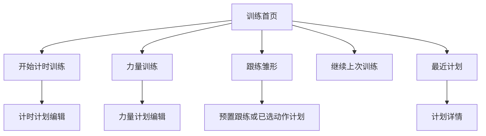
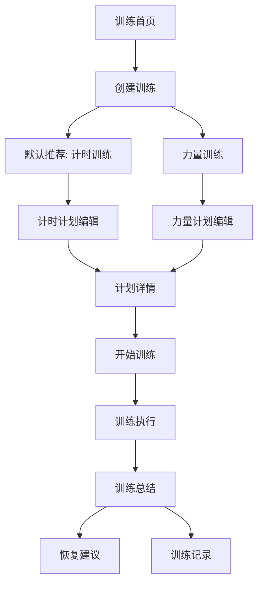
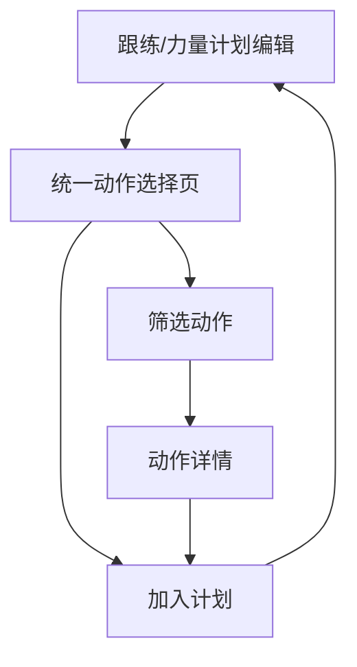
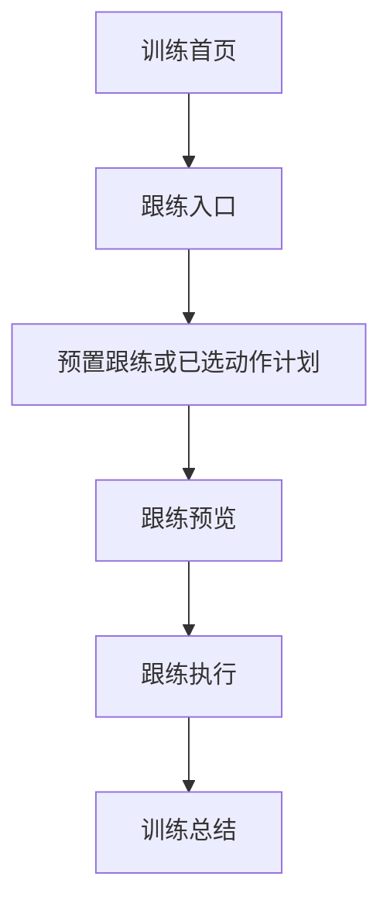
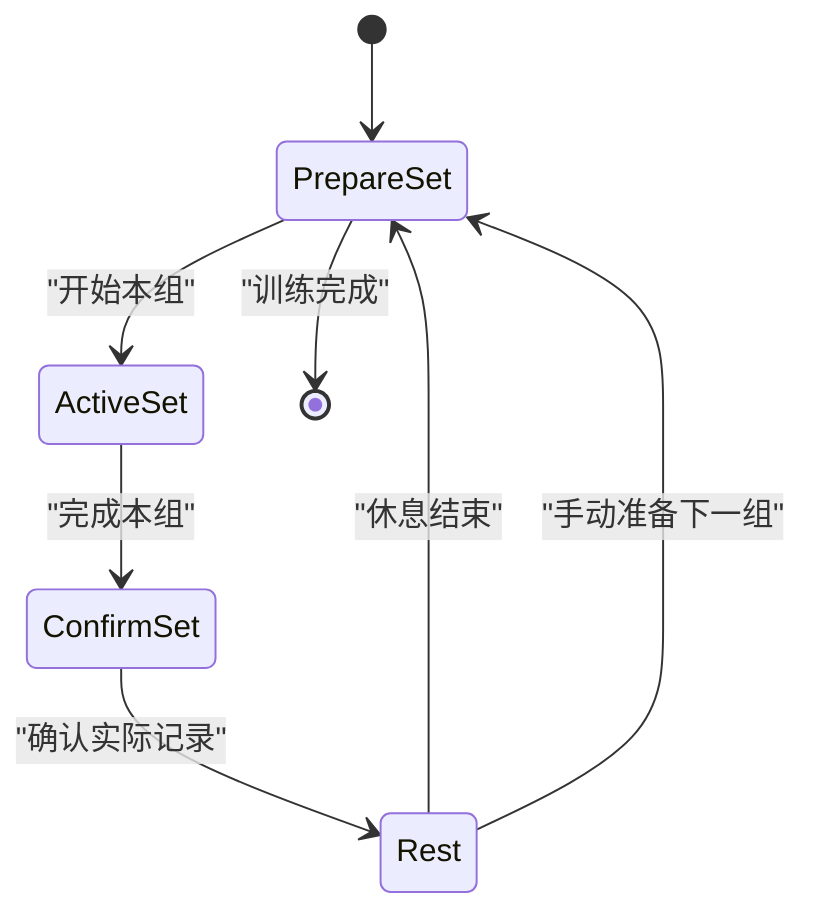

# TrainFlow UX 页面流与关键交互说明

**文档状态:** 初稿  
**日期:** 2026-05-21  
**目标:** 为首版前端原型、后续设计系统和 Figma 设计提供页面流与交互骨架。

## 1. UX 目标

TrainFlow 的首版 UX 应优先保证三件事：

1. 新用户不用理解复杂训练理论，也能快速进入计时训练。
2. 有经验用户能在力量训练里精细设定重量、次数、热身组、组间休息和逐组目标。
3. 训练执行中信息清晰、按钮可靠、提醒及时，用户在运动中不用反复思考下一步。

## 2. 体验原则

### 2.1 默认简单，深度可展开

- 首页与创建入口默认推荐计时训练。
- 力量训练入口必须清晰可见，不作为隐藏高级功能。
- 复杂设置放在编辑页的高级区域，不塞进首次创建第一屏。

### 2.2 编辑时完整，训练时克制

- 编辑页可承载计划配置、提醒阈值、组参数和高级设置。
- 执行页主信息只能服务当前动作、当前阶段、剩余时间或本组目标。
- 动作教学、历史趋势、详细设置通过展开层或次级页面进入。

### 2.3 反馈要分层

- 主反馈：倒计时、当前组、开始本组、完成本组。
- 次反馈：下一动作、心率、当前轮次、预计剩余。
- 强反馈：临近结束倒计时、休息结束提醒、训练完成。

### 2.4 未来能力留接口，不提前占体验

- 实时心率先有展示位与状态，不在首版抢主信息。
- 语音、课程、AI 纠错、音乐节拍留扩展点，但不让首版页面看起来像未完成课程平台。

### 2.5 E10.1 执行页主操作原则

- 训练中的主操作必须即时可达。
- 看到时间或动画的位置，就是可以控制训练节奏的位置。
- 暂停/继续、结束、跳过/下一步、开始本组、确认本组不能藏到需要滚动才能找到的位置。
- 结束训练可以即时可达，但应有二次确认防误触。
- 心率、说明、提示、下一步信息都应低于当前动作/阶段/时间/主操作层级。
- E10.3 已将该原则落到力量和基础跟练执行页：主控制固定在底部，当前组计时 / 休息倒计时 / 跟练倒计时区域也可作为暂停或继续入口。

## 3. 信息架构

### 3.1 一级导航建议

首版建议保留 4 个一级区域：

1. **训练**
2. **计划**
3. **动作库**
4. **记录**

### 3.2 训练首页的功能关系

### 3.3 页面清单

首版原型应覆盖：

1. 训练首页。
2. 训练模式选择页或创建入口面板。
3. 计时训练计划编辑页。
4. 力量训练计划编辑页。
5. 计划详情与开始训练页。
6. 动作库列表页。
7. 动作详情页。
8. 计时训练执行页。
9. 力量训练执行页。
10. 跟练训练雏形页。
11. 训练总结页。
12. 训练记录与趋势页。
13. 恢复建议页。
14. 训练提醒与偏好设置页。

## 4. 全局页面流

### 4.1 新建训练流

### 4.2 动作选择流

E10.1 后，计时训练不进入动作选择流。统一动作选择页服务跟练训练和力量训练：跟练选择动作并管理顺序，力量选择动作后回到力量编辑页设置重量、次数、组数和休息。

### 4.3 跟练雏形流

## 5. 训练首页

### 5.1 页面目标

让用户能马上开始训练，同时知道三种训练模式的关系。

### 5.2 页面结构建议

从上到下：

1. 顶部状态区
   - 今日日期或问候。
   - 最近训练摘要。
   - 设备或心率入口可后置，不占首屏主导。
2. 主操作区
   - 主按钮：开始计时训练。
   - 并列次入口：力量训练。
   - 并列次入口：跟练。
3. 继续训练区
   - 上次未完成训练。
   - 最近复用计划。
4. 今日计划区
   - 已安排训练。
   - 计划提醒状态。
5. 快捷入口
   - 动作库。
   - 记录。

### 5.3 首页关键交互

- 点主按钮默认进入计时训练快速创建；如存在可复用最近模板，可在快速创建页提供一键沿用。
- 点力量训练进入力量计划创建，不要求先从通用计划页绕行。
- 点最近计划可直接开始，也可先查看详情。

## 6. 创建与计划编辑

### 6.1 创建入口

创建页或入口面板应先讲清模式差异：

| 模式 | 用户理解 |
|---|---|
| 计时训练 | 按阶段时长、休息、轮次或自定义节奏训练 |
| 力量训练 | 按重量、次数、组数和休息训练 |
| 跟练 | 跟着动作演示和流程提示训练 |

首版默认高亮计时训练。力量训练应保持同屏可见。

### 6.2 计时训练计划编辑页

#### 页面目标

让用户快速编排一个按阶段推进的纯间歇计时器。

#### 页面信息结构

1. 计划基础信息
   - 名称。
   - 提醒时间。
   - 预计时长。
2. 阶段编排
   - 热身。
   - 工作。
   - 休息。
   - 放松。
   - 自定义阶段。
3. 阶段编辑
   - 阶段名称。
   - 阶段时间。
   - 阶段图标。
   - 阶段颜色。
   - 轮数。
   - 阶段顺序。
4. 提醒设置
   - 阶段临近结束提醒。
   - 休息临近结束提醒。
   - 默认最后 5 秒。
   - 声音、震动、强化动画开关。
5. 计划视觉
   - 主题色或配色（E10.2 先保留为后续 polish，当前阶段卡已提供阶段颜色选择）。
6. 开始与保存
   - 保存计划。
   - 立即开始。

#### 关键交互

- 计时训练不进入动作库，不选择动作，不展示动作详情或动作推荐。
- 每个阶段行支持快速复制、删除、拖动排序，并保留上移 / 下移作为备用和无障碍排序路径。
- E10.2 Review Gate 已补齐拖动排序：只有阶段行右侧明确的拖动手柄可触发长按拖拽，输入框、类型选择、颜色 / 图标入口、复制 / 删除和行空白区域不触发排序，非手柄区域上下滑动继续滚动编辑页。
- 热身固定在开头，放松固定在最后，中间的工作、休息和自定义阶段可排序；阶段卡提供内置颜色 swatch，阶段类型选择同步图标 key。
- 阶段图标表达阶段类型或状态，不作为动作内容指导。
- 提醒设置用默认值即可开始训练，高级阈值可展开。
- 用户提供的大圆盘 UI 可作为 E10.2 视觉参考，但后续实现必须转化为 TrainFlow 自己的视觉语言，不能逐像素照搬。

### 6.3 力量训练计划编辑页

#### 页面目标

让用户能先用合理默认值创建计划，再逐步展开高级组设定。

#### 页面信息结构

1. 计划基础信息
   - 名称。
   - 提醒时间。
   - 预计动作数。
2. 动作列表
   - 动作名称。
   - 目标重量。
   - 目标次数。
   - 默认次数区间 `8-12`。
   - 组数。
   - 组间休息。
3. 动作内组配置
   - 热身组。
   - 正式组。
   - 逐组目标重量和次数。
4. 高级设置
   - 每组耗时记录方式。
   - 默认手动点击开始本组。
   - 自动开始计时切换。
   - 动作替代候选。
5. 开始与保存
   - 保存计划。
   - 立即开始。

#### 关键交互

- 新增强力量动作时自动带入 `8-12` 次默认区间。
- 简单模式下先让多个正式组共用目标重量与次数。
- 展开逐组设置后，用户可给不同组配置不同重量与次数。
- 热身组应在动作内配置，不依赖全局热身阶段替代。

## 7. 动作库

### 7.1 动作库列表页

#### 页面目标

在计划编辑和自由浏览两种场景下都能快速找到动作。

#### 筛选建议

- 训练模式能力：计时、次数、重量、跟练。
- 训练部位。
- 器械。
- 难度。
- 热身、正式训练、拉伸。

### 7.2 动作详情页

#### 页面结构建议

1. 动作名称与分类。
2. 演示媒体位。
3. 训练部位与器械。
4. 标准步骤。
5. 发力要点。
6. 常见错误。
7. 呼吸提示。
8. 注意事项。
9. 训练中短提示。
10. 替代动作与恢复映射预留。

### 7.3 训练中动作详情

训练执行中查看动作详情应优先使用可快速关闭的覆盖层：

- 先显示训练中短提示。
- 需要时展开步骤和错误提醒。
- 关闭后回到原训练状态，不丢计时。

## 8. 计时训练执行页

### 8.1 页面目标

在运动中让用户一眼知道：

- 现在处于哪个阶段。
- 还剩多久。
- 下一步是什么。
- 什么时候该切换。

### 8.2 信息层级

#### 主信息

- 当前阶段图标。
- 当前阶段名称或编号。
- 当前阶段倒计时。
- 大圆盘主控制区。

#### 次信息

- 下一阶段预告。
- 总训练进度或预计剩余。
- 当前阶段进度、整体进度、轮次或阶段位置。
- 实时心率展示位。

#### 控制区

- 点击中心圆盘暂停 / 继续。
- 跳过或下一阶段。
- 结束训练。

E10.1 后，计时训练执行页不显示动作详情入口，不展示动作库短提示，也不依赖动作内容推进。

### 8.3 倒计时状态

| 状态 | 视觉与反馈 |
|---|---|
| 正常工作计时 | 稳定大数字，大圆盘或进度环保持主视觉 |
| 阶段临近结束 | 最后 N 秒放大跳动、屏幕闪烁或强化动画，声音与震动按设置触发 |
| 正常休息计时 | 显示休息状态、下一阶段和准备信息 |
| 休息临近结束 | 最后 N 秒强化倒计时，强调下一阶段即将开始 |
| 暂停 | 时间冻结，明确暂停层 |
| 阶段切换 | 短促过渡，提示进入工作、休息、放松、自定义阶段或下一轮 |

暂停时后续应记录暂停总时长。训练记录应区分本次总耗时、有效训练时间和暂停总时长。

### 8.4 大圆盘交互

- 大圆盘是计时训练执行页的核心视觉和主控制区。
- 顶部可显示总剩余时间，但不抢占中心倒计时。
- 中心显示当前阶段图标、阶段名称或编号、当前阶段倒计时。
- 圆环显示整体进度、当前阶段进度、轮次或阶段位置。
- 点击中心圆盘暂停或继续。
- 最后 N 秒可触发屏幕闪烁、动画提醒和声音提醒。
- 当前阶段开始可预留固定语音 cue，例如 `warm up`、`work`、`rest`、`cool down`；用户自定义文字 TTS 不属于第一版。

### 8.5 Timer Dial 圆盘视觉语言

E10.5 后，计时训练大圆盘进入 Timer Dial 视觉语言重构流程。该方向参考用户喜欢的黑红高对比圆盘体验，但必须转化为 TrainFlow 自己的视觉语言，不复制外部 APK / 截图的代码、资源、图标、字体、音频、专有动画或逐像素视觉。

Timer Dial 的页面结构建议：

1. 顶部显示本次训练总剩余时间。
2. 外圈表达本轮或当前运动结构：`work` / `rest` / `warmup` / `cooldown` 用不同颜色区分，`work` 弧线更粗，`rest` 弧线更细，当前阶段弧线有进度动画。
3. 内圈表达整次训练总进度。
4. 中心圆表达当前阶段：阶段图标、阶段编号或名称、当前阶段倒计时，并支持点击暂停 / 继续。
5. 底部只保留少量图标操作：重置、跳过 / 下一阶段、结束。

文字应尽量少，用图标、颜色、粗细、弧线层级和动效表达信息。心率、下一阶段、说明和记录信息仍保持辅助层级，不进入中心圆主信息。

Timer Dial 动效必须来自 TrainFlow engine state，不允许视觉假进度。必须覆盖阶段弧线推进、总进度弧线推进、`work` / `rest` 切换时颜色和粗细变化、阶段切换动效、暂停态动效和最后 N 秒提醒动效。暂停时进度冻结并显示暂停状态；completed / abandoned 后不继续推进。

工具路线：

- Figma 用于静态界面、风格方案、颜色 / 组件 / 布局规格。
- HTML / Canvas 可选用于快速验证圆盘动画和阶段弧线节奏。
- Jetpack Compose Canvas 是最终 Android 生产实现方式。
- Rive / Lottie 只用于小图标或装饰微动效，不用于核心计时进度。

### 8.6 心率展示位

> E11.3 更新：首版已撤销心率显示、录入和统计。当前执行页不显示心率位，以下仅作为未来健康设备阶段重新评估时的历史参考。

若未来恢复，建议放在次信息区，不与倒计时争夺中心位置。

| 状态 | 表现建议 |
|---|---|
| 未连接 | `-- bpm` + 未连接设备 |
| 等待数据 | 连接中或等待心率 |
| 正常 | 当前 bpm + 数据状态 |
| 中断 | 上次值弱化 + 数据中断提示 |
| 后续提醒 | 预留状态色与提示文案 |

## 9. 力量训练执行页

### 9.1 页面目标

帮助用户稳定完成每一组，同时把实际数据记录负担压低。

### 9.2 力量训练主状态

E10.3 后，力量执行页只修复主操作可达性，不做完整新版力量 UI。开始本组、完成本组、确认本组、休息中提前开始本组、暂停 / 继续和结束训练应在固定底部控制区即时可达；当前动作 / 组计时 / 休息倒计时主面板可点击暂停或继续。结束训练需要二次确认。确认层输入区域必须保留足够底部留白，不能被固定控制区遮挡重量、次数或感受选择。

### 9.3 准备本组页面状态

主信息：

- 当前动作。
- 当前组序号。
- 计划重量。
- 计划次数或次数区间。
- 组间休息状态。

主按钮：

- `开始本组`

次操作：

- 看动作要点。
- 改本组计划。
- 换动作。
- 跳过。

### 9.4 本组进行中状态

主信息：

- 当前动作。
- 组耗时计时器。
- 本组目标重量与次数。

主按钮：

- `完成本组`

辅助信息：

- 动作短提示。
- 心率展示位。

### 9.5 完成本组确认层

完成后应出现轻量确认层，而不是要求用户从零填写：

- 实际重量默认带入计划重量。
- 实际次数默认带入计划次数或便于选择区间内结果。
- 感受快速选择。
- 保存并开始休息。

建议快捷选项：

- 轻松。
- 刚好。
- 很吃力。
- 动作变形。

### 9.6 休息状态

主信息：

- 休息倒计时。
- 下一组计划重量和次数。
- 下一组动作，如进入新动作则显示新动作名。

强提醒：

- 休息临近结束时强化倒计时。
- 提醒用户准备开始下一组。

次操作：

- `+15 秒`
- `+30 秒`
- 跳过休息。
- 提前开始本组。

## 10. 跟练训练雏形页

### 10.1 页面目标

先验证“动作演示 + 当前提示 + 时间推进”是否顺畅。

E10.1 后，跟练训练后续通过统一动作选择页选择动作，入口页和编辑页只展示已选结果与核心参数，不堆大量动作列表。跟练结构后续应类似计时训练：热身、动作、休息、轮次、放松，但动作来自动作选择页。

### 10.2 页面结构

1. 当前动作演示媒体位。
2. 当前动作名称。
3. 当前动作计时或阶段进度。
4. 动作短提示。
5. 下一动作预告。
6. 心率展示位。
7. 暂停、跳过、动作详情、结束。

E10.3 后，基础跟练执行页的暂停 / 继续、跳过 / 下一步和结束训练固定在底部即时可达；当前动作计时区域可点击暂停或继续。结束训练需要二次确认。动作详情、心率、边界说明和下一动作预告保持辅助层级，不把跟练雏形扩展成完整课程平台。

### 10.3 预留能力

- 教练视频媒体位。
- 语音提示事件。
- 课程章节信息。
- 音乐节拍时间轴。
- AI 分析结果提示位。

首版不在页面上展示无法工作的假入口。

## 11. 训练总结与记录

### 11.1 计时训练总结

建议展示：

- 训练完成状态。
- 总时长。
- 完成轮数。
- 跳过动作。
- 休息延长情况。
- 恢复建议入口。

### 11.2 力量训练总结

建议展示：

- 完成动作列表。
- 每动作计划与实际差异。
- 重量、次数与组数。
- 训练容量摘要。
- 每组耗时与实际休息。
- 主观感受。
- 历史趋势入口。

### 11.3 记录与趋势页

首版趋势优先做：

- 单动作重量与次数历史。
- 训练容量历史。
- 固定重量与固定次数下的组耗时变化。

趋势页应避免直接用“更快就一定更强”的文案做结论。

## 12. 恢复建议页

### 12.1 首版页面目标

基于本次训练涉及肌群，给出简明恢复建议。

### 12.2 页面结构

1. 今日主要训练部位。
2. 推荐放松区域。
3. 基础图文说明。
4. 拉伸或放松动作建议。
5. 后续身体图和按摩点位预留。

## 13. 设置与偏好

首版训练偏好至少考虑：

- 默认临近结束提醒秒数。
- 动作提醒开关。
- 休息提醒开关。
- 声音开关。
- 震动开关。
- 强化倒计时动画开关。
- 计时训练自动推进偏好。
- 力量训练本组计时默认模式。
- 心率显示开关或设备状态入口预留。

## 14. 前端原型优先级

### P0 原型页面

1. 训练首页。
2. 计时训练计划编辑页。
3. 计时训练执行页。
4. 力量训练计划编辑页。
5. 力量训练执行页。
6. 单组完成确认层。
7. 动作库列表与动作详情。
8. 训练总结页。

### P1 原型页面

1. 跟练训练雏形页。
2. 恢复建议页。
3. 训练记录与趋势页。
4. 提醒与偏好设置页。

## 15. 原型验证清单

第一轮前端原型完成后，至少验证：

1. 新用户能否在少量输入后开始一套计时训练。
2. 力量训练用户能否理解开始本组、完成本组和休息切换。
3. 单组确认层是否足够快，不打断训练节奏。
4. 动作提醒和休息提醒在页面上是否区分清楚。
5. 临近结束倒计时动画是否明显但不烦。
6. 心率展示位是否可见但不抢主任务。
7. 训练中打开动作详情后是否能无损返回。
8. 跟练雏形是否复用计时训练逻辑而不显得像空壳。

## 16. 待确认项

UX 进入前端原型前仍需逐步确认：

1. E10.2 计时训练阶段模型如何映射到现有 Android `WorkoutPlan` / `PlanBlock`，是否需要另起契约 story。
2. 心率展示位是否默认显示未连接状态，还是仅在用户启用后显示。
3. 首批恢复建议页面是否需要身体区域示意图占位。
4. 统一动作选择页的推荐规则和动作详情预览深度。
