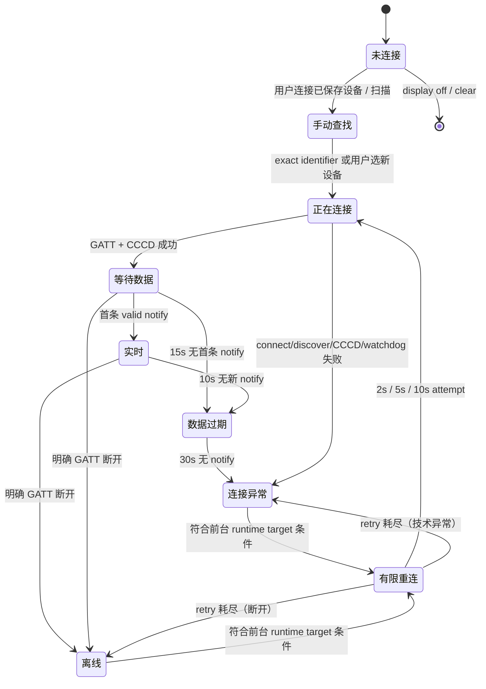

# E16-10a 心率数据新鲜度、离线与重连策略规划

**状态：** Policy approved / Needs review — 主管理对话已确认策略；本文仍是 docs-only 记录，不代表 E16-10b 已开始或已实现
**日期：** 2026-07-11
**前置：** E16-9 / E16-9b 已 reviewed / merged（`3271697fbc5c3d3385fbcdbc214f4d1a9a2c6832`），Band 9 修复后人工验收通过
**范围：** 前台 live BLE HRS 的 freshness、unexpected disconnect、有限重连与用户可见恢复策略
**不在范围：** Kotlin/Compose/manifest/Gradle/Room/DataStore schema 改动；自动重连实现；1 秒采样、session record、records/history/trends、E16-11 recording、E16-12 analysis/recap

## 1. 结论摘要

已批准 **方案 B：仅对已在当前前台进程成功 live 的同一设备，允许有限、可见、无扫描的直接 GATT 重连**。它只覆盖用户已经显式 opt-in、授权、选择并连接成功过的 runtime target；不把已保存 identifier/displayName 当作在线身份，也不在冷启动、回到前台或蓝牙恢复时主动 scan/connect。

已批准的默认参数是：有效 bpm 在最后一条有效 `0x2A37` notify 后 **10 秒**内；连续 **10 秒**无新 notify 进入 `数据过期`；已连接但从 notify enable 起 **15 秒**仍无首条数据也进入 `数据过期`；连续 **30 秒**无数据则判为 notify 停止的 `连接异常`。明确 GATT 断开直接进入 `离线`，连接、service discovery、CCCD、解析或 silence 技术失败进入 `连接异常`，不保留或展示旧 bpm。意外失联后按 **2 秒、5 秒、10 秒**退避尝试最多 **3 次** direct GATT reconnect；每次连接最多等待 **10 秒**回调。任何用户停止、关闭、清除、切换 target、权限/蓝牙不可用、进后台或 retry 耗尽都会取消队列并终止自动恢复。

以上阈值是已接受的产品默认值，不代表 Android 常量已经实现；E16-10b 必须将其建模为可测试的 policy/time source，而非把 timer 直接散落在 UI。

## 2. 已确认事实

1. 心率显示默认关闭，必须显式 opt-in、授权并由用户选择设备；胶囊点击、展开、拖动不会触发 scan/connect。
2. DataStore 只保存 `identifier` / `displayName` 偏好，不保存 `BluetoothDevice`、`BluetoothGatt`、SDK model、bpm 或 session summary；已保存设备不代表当前已连接、在附近或正在广播。
3. 冷启动不会自动 scan/connect。用户点击 `连接已保存设备` 后，才可进行一次约 12 秒、标准 HRS `0x180D` 的 identifier 精确匹配查找；同名设备不得自动连接，timeout 不重试。
4. live bpm 时 `扫描其他设备` 与 provider state 分离；scan/candidates/timeout 不得覆盖当前 GATT 或 bpm，只有用户手选新设备才切换 target。
5. E16-9 Band 9 验收已证明手动选择、live bpm、关闭广播后 `连接异常`、冷启动中性未连接，以及用户点击后的 exact-identifier reconnect 路径；尚未定义 broadcast 恢复后的自动行为、retry/backoff 或 stale/offline 时序。
6. 现有 provider 已有 `CONNECTED_WAITING_FOR_DATA`、`LIVE_BPM`、`STALE`、`DISCONNECTED`、`ERROR` 状态承载位，但当前没有 freshness timer、连接 watchdog 或重连 scheduler。`STALE` / `DISCONNECTED` 当前都会映射到 `stale_reading`，胶囊已能区分 `数据过期` 与 `离线`。
7. 心率仍只读显示；不做医疗告警、声音、震动、强制暂停或训练中断，也不进入 E16-11 / E16-12。

## 3. 已批准决策

- 只允许当前前台进程、且本次已成功进入 live bpm 的同一 runtime target 做有限 direct GATT reconnect。
- 采用 10 / 15 / 30 秒 freshness 阈值，以及 2 / 5 / 10 秒、最多 3 次、每次 10 秒 watchdog 的重连预算。
- 不允许后台自动连接；冷启动、回到前台、蓝牙恢复和 retry 耗尽后均不自动 scan/connect。
- E16-10b 必须在设置页提供可见的 `停止连接` 操作；它取消队列并抑制本前台周期的自动恢复，直到用户手动连接或选择新设备。
- retry exhausted 不新增历史事实状态：明确断开保持 `离线`；connect / notify / parse / silence 技术失败保持 `连接异常`；设置页可显示 `自动重连已停止，请手动连接`。

## 4. 策略方向

| 方向 | 规则 | 优点 | 风险 / 缺点 |
|---|---|---|---|
| A. 全部手动恢复 | 任何断开、error、notify 停止或广播恢复后都不重连；用户手动点击已保存设备或重新扫描。 | 最容易解释；严格延续 E16-9 的无自动连接边界；最少 BLE lifecycle 风险。 | 训练中 Band 9 短暂广播中断会造成不必要摩擦；用户需离开训练流恢复，不能利用已明确同意的 runtime connection。 |
| B. 前台、同 target、有限 direct reconnect（已批准） | 只对当前进程里曾 live 的同一 `BluetoothDevice` / selected runtime target；意外中断后 2/5/10 秒退避，最多 3 次；不 scan、不换 target、全程可见。 | 在不把保存偏好当连接身份的前提下恢复短暂中断；不违反冷启动无自动 scan/connect；target 不漂移，容易验证和取消。 | 需要单一 scheduler、attempt watchdog、生命周期取消和真机覆盖；Band 9 恢复得太晚仍要用户手动恢复。 |
| C. 自动重新扫描并匹配保存 identifier | 失联后自动启动 bounded HRS scan，发现相同 identifier 后连接。 | 广播恢复较晚时成功率可能更高。 | 与 E16-9 的冷启动 / 无静默扫描边界冲突；identifier 只是 convenience hint，地址随机化会失败；扫描会增加隐私、功耗与 scan-vs-live 竞争风险。**不推荐。** |

## 5. 已批准方案 B 的策略合同

### 5.1 Freshness 与状态阈值

所有时间使用 monotonic clock（不是 wall clock）；每次有效、可解析的 HRS notify 重置计时。`measuredAt` 仅用于用户显示，不可承担 timeout 判断。

| 起点 / 条件 | 时间或事件 | provider / 用户可见状态 | 处理 |
|---|---:|---|---|
| CCCD notify enabled，尚无首条 valid bpm | 0–15 秒 | `等待数据` | 保持连接；不显示旧 bpm；不重连。 |
| notify enabled，仍无首条 valid bpm | 15 秒 | `数据过期` | 表示连接存在但没有可用数据；不把等待无限延长。 |
| 最近一条 valid bpm | 0–10 秒 | live bpm | 显示最新 bpm / 已有区间；`更新：实时`。 |
| 最近一条 valid bpm | 10–30 秒无 notify | `数据过期` | 隐藏 bpm / 区间；保留来源和“上次更新”供 expanded 使用；尚不换 target。 |
| 首条数据一直未到，或已有数据后 | 30 秒连续无 notify | `连接异常`（notify stopped） | 关闭当前 GATT，进入有限 retry；不是医疗或训练异常。 |
| `onConnectionStateChange(...DISCONNECTED)` 且非用户操作 | 立即 | `离线` | 不显示缓存 bpm；进入有限 retry。 |
| GATT status / connect / discover / CCCD / parse error | 立即 | `连接异常` | 关闭 GATT；允许符合条件时进入有限 retry。 |

`数据过期` 是数据质量状态，不是“设备已经离线”的同义词；`离线` 只用于明确断开或 retry exhausted 后仍找不到当前 runtime target；`连接异常` 用于连接/订阅/解析或 notify silence 的技术异常。E16-10b 应保留原因码给设置页，不让胶囊以 GATT status code 面向用户。

### 5.2 事件语义与优先级

| 事件 | 可见结果 | retry 队列 | 已保存偏好 / 连接 target |
|---|---|---|---|
| 用户关闭心率显示 | 胶囊隐藏 | 立即取消；stop scan + disconnect；本前台周期不得自动恢复 | 保留 saved identifier/displayName，runtime target 清空 |
| 用户主动停止连接 | `未连接`，并标明“已停止连接”仅在设置页显示 | 立即取消；本前台周期 suppress，直至用户手动连接或选新设备 | 保留 saved preference；断开 runtime GATT |
| 用户主动清除设备 | `未连接源` | 立即取消；stop scan + disconnect | 清除 saved preference 和 runtime target |
| 用户手动 `连接已保存设备` | `正在查找已保存设备` / `正在连接` | 取消旧队列；该手动意图优先 | 只允许约 12 秒 exact-identifier scan；无匹配不自动 retry |
| 用户手动重新扫描 | `扫描中` 或 live 时 `扫描其他设备` | 非 live 时取消队列；live 时队列暂停至 scan 结束 | 候选不会自动换 target；手选新设备才取消旧 target / queue |
| 用户手选新设备 | `正在连接` 新设备 | 取消旧 target 的所有 attempt | 新 selection 成为唯一 target；只有它成功 live 后才有未来 auto-retry 资格 |
| 权限丢失 / 被永久拒绝 | `权限未赋予` | 立即取消；不请求系统权限 | 保留 saved preference；disconnect |
| 蓝牙关闭 | `蓝牙关闭` | 立即取消；不监听蓝牙恢复后自动开始 | 保留 saved preference；disconnect |
| App 进入后台、process dispose | 保持最后已知不可用状态或停止状态，不以后台 timer 更新胶囊 | 立即取消；不后台 scan/connect | 关闭 GATT；回前台不自动恢复 |
| 冷启动 / 回到前台 | `未连接 + 已保存设备` 或当前前台真实 live 状态 | 不建立新队列 | 不自动 scan/connect；由用户发起下一步 |

### 5.3 有限重连

触发资格必须同时满足：显示偏好仍开启、权限和蓝牙仍可用、App 在前台、当前 process 有同一设备曾进入 `LIVE_BPM` 的 runtime `BluetoothDevice`、用户未 stop/clear/disable、没有手动 scan/target switch 在进行。

| 项目 | 推荐规则 |
|---|---|
| 目标 | 只对 current-process 同一 runtime target 直接 `connectGatt`；不 scan、不按 display name、不过 identifier 重新发现、不自动选候选。 |
| 预算 | 最多 3 次 retry；初始连接不计入此预算。 |
| 退避 | 发生可恢复异常后等待 2 秒、5 秒、10 秒再发起第 1/2/3 次。每次新 attempt 前再次检查资格。 |
| attempt watchdog | 每次 `CONNECTING` 最多 10 秒；无成功连接/notify 前进时关闭该 GATT，计为失败，继续下一次退避。 |
| 成功条件 | 重新收到第一条 valid bpm 才清除 attempt count 并恢复 live；仅连接或 notify enabled 不算恢复完成。 |
| 终止 | 用户意图、权限/蓝牙不可用、后台、target 改变、scan 冲突、3 次均失败或运行时 target 丢失；终止后绝不自动 scan。 |
| 耗尽后的状态 | 最近明确 disconnect -> `离线`；connect/notify/parse/silence failure -> `连接异常`；设置页显示“自动重连已停止，请手动连接”。 |

这不是 cold-start reconnect：进程被杀后没有可信 runtime target，因此 restart、回前台、Band 9 后来恢复广播均只能显示已保存偏好并提供用户动作。若广播在同一前台进程的有限 retry 窗口内恢复，方案 B 的 direct reconnect 可以成功；若在窗口之外恢复，用户使用 `连接已保存设备`。

## 6. 状态机与转移表

上图的 `手动查找` 只代表用户主动的 bounded scan，不可由 `有限重连` 进入。display off、主动停止、clear、权限丢失、蓝牙关闭和后台是高优先级 interruption：先取消 timer/retry/GATT，再映射各自状态，不能由延迟 callback 把 UI 重新写回 `正在连接` 或 live。

## 7. 用户可见文案与状态色

色彩只表达连接/数据状态，遵循 DESIGN 的弱提示、非医疗语气；有 bpm 的区间色仍只在 fresh live 数据下显示。所有失效状态都不用深红“超过上限”色。

| 状态 | 胶囊 collapsed | expanded / 设置页说明 | 下一步 | 色彩 |
|---|---|---|---|---|
| 等待首条数据 | `等待数据` | `设备已连接，正在等待心率数据。` | `停止连接`（设置页） | 中性灰 / info |
| 数据过期 | `数据过期` | `最近超过 10 秒没有新的心率数据，当前不显示旧 bpm。` | `等待恢复`；需要时 `重新连接` | 弱提示黄褐 / warning，非 alarm |
| 正在自动恢复 | `正在重新连接` | `与 {设备名} 的连接中断，正在尝试重新连接（第 n/3 次）。不会扫描或切换设备。` | `停止连接` | info 蓝 / 中性 |
| 离线 | `离线` | `与 {设备名} 的连接已断开。自动重连已停止。` | `连接已保存设备`；可 `扫描心率设备` | 中性灰 |
| 连接异常 | `连接异常` | `未能继续接收 {设备名} 的心率数据。自动重连已停止。` | `连接已保存设备`；可 `扫描心率设备` | warning 黄褐，不用医疗红 |
| 蓝牙关闭 | `蓝牙关闭` | `请开启蓝牙后，再手动连接已保存设备。` | 打开系统蓝牙后由用户手动连接 | 中性灰 |
| 权限未赋予 | `权限未赋予` | `需要蓝牙权限才能扫描或连接你主动选择的设备。` | `重新授权蓝牙权限` / `去系统设置开启` | 中性灰 / info |
| 用户已停止 | `未连接` | `已停止连接 {设备名}；已保存设备不代表当前已连接。` | `连接已保存设备` | 中性灰 |
| 已保存未连接 | `未连接` | `已保存：{设备名}。设备可能不在附近、未广播或未连接。` | `连接已保存设备` | 中性灰 |

“已保存设备”只能作为 `来源` 或设置页偏好行出现，绝不能替代 `连接状态`。胶囊 expanded 的 `记录` 继续只显示 `当前只显示状态` / `训练记录：后续开启`，不出现采样、平均值、图表或复盘承诺。

## 8. E16-10b 实现拆分（未开始）

1. **E16-10b-1 policy/core:** 定义 freshness clock、notify timestamp、等待/过期/异常转移、reason codes 和纯 Kotlin unit tests；不改 `HeartRateState` 历史事实边界，不写 Room/DataStore schema。
2. **E16-10b-2 foreground reconnect controller:** 为已 live 的 runtime target 实现单一、可取消的 2/5/10 retry scheduler 与 10 秒 attempt watchdog；处理 GATT callback race、old callback target guard、scan conflict 和 lifecycle cancellation；禁止自动 scan。
3. **E16-10b-3 UI mapper/settings copy:** 把 approved reason / attempt 映射为上表文案和弱状态色，明确 `停止连接`、手动连接、scan、clear、disable 的优先级；不新建视觉页面。
4. **E16-10b-4 verification / closeout:** focused state-machine tests、Android build/lint/check、AVD non-BLE UI mapping smoke 和真实 Band 9 验收；没有真机证据不得宣称广播恢复自动 reconnect 已关闭。

每个 implementation story 都必须避免让 scanner state 覆盖 active provider/bpm，也不得以 UI callback 直接驱动 engine、records 或 session。

## 9. 验证矩阵与 Band 9 验收

| 场景 | 预期状态 / 行为 | 必需证据 |
|---|---|---|
| Band 9 live 后关闭心率广播 | 10 秒 `数据过期`；明确 disconnect 则立即 `离线`，否则 30 秒 `连接异常`；最多 3 次 direct retry | 时间戳日志 + 胶囊/设置页状态；不显示旧 bpm |
| 同一前台进程内恢复 Band 9 广播 | 在未耗尽 budget 的 direct retry 中恢复；首条 valid bpm 后回 live 并清计数 | 3 次以内实际成功或明确未成功的 Band 9 结果 |
| 广播在 retry 耗尽后恢复 | 不自动 scan/connect；维持 `离线`/`连接异常`，用户点击 `连接已保存设备` 才进行 12 秒 exact scan | 无自动 scan/connect log；手动 reconnect 通过 |
| 蓝牙关闭再开启 | 立即 `蓝牙关闭`、取消 queue/GATT；恢复蓝牙后不自动 scan/connect | 系统状态 + 无自动动作日志 |
| 权限撤销 / 永久拒绝 | `权限未赋予`、取消 queue/GATT；不重复请求权限 | 设置页文案与无 retry 日志 |
| App 前台 -> 后台 -> 前台 | 后台取消 retry / disconnect；回前台不自动恢复，仅显示已保存未连接或明确状态 | lifecycle log；无后台 scan/connect |
| cold start with saved device | `未连接 + 已保存设备`；绝不自启 retry/scan/connect | fresh install/data injection + log |
| waiting first notify | 15 秒进入 `数据过期`；30 秒进入 `连接异常` 与 retry eligibility | deterministic clock test + Band 9 / fake provider |
| live notify silence | 10 秒进入 `数据过期`；30 秒通知异常；不显示旧 bpm | deterministic clock test |
| 用户停止连接 | 停止后没有 retry；手动连接才可恢复 | UI action + delayed-callback race test |
| 手动扫描 / 手选新设备 | live scan 不污染旧 bpm；选新设备取消旧 queue；新 target 才可重连 | existing E16-9 isolation regression + target guard |
| retry 耗尽 | 3 次后终止，无自动 scan；文案提供手动下一步 | scheduler test + real-device failure run |

真实 Band 9 验收还应记录系统蓝牙状态、是否在前台、广播恢复时点、每个 retry 的 attempt number 与结果；截图和设备日志仅存 `.local/smoke/e16-10-.../`，不提交。

## 10. 与 E16-11 / E16-12 的隔离

- E16-10 只决定瞬时 display/provider lifecycle；任何 stale、offline、retry timestamp、bpm 或错误原因都不是训练记录样本，不写 `WorkoutSession`、Room、records/history/trends。
- E16-11 才能决定训练期间 1 秒采样、来源、持久化、缺口和 session schema；E16-10 不预先添加字段或 DataStore schema。
- E16-12 必须等待 E16-11 的已保存、来源明确样本，并先通过独立 E16-12a 高保真视觉评审；E16-10 不做平均值、区间时长、曲线、复盘、训练建议或医疗解释。

## 11. 主管理确认记录

2026-07-11，主管理对话确认方案 B、10 / 15 / 30 秒 freshness、2 / 5 / 10 秒退避、最多 3 次 retry、每次 10 秒 watchdog、前台同 runtime target 资格、设置页 `停止连接` 操作，以及 retry exhausted 沿用 `离线` / `连接异常` 历史事实状态并补充手动恢复文案。方案 C 的自动扫描恢复不进入当前策略。

E16-10a 的 docs-only 交付状态为 **implemented / needs review**。E16-10b 仍未开始；不得把本次批准记录写成 timer、自动重连、自动扫描、UI 操作或验证已经实现。
